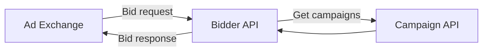
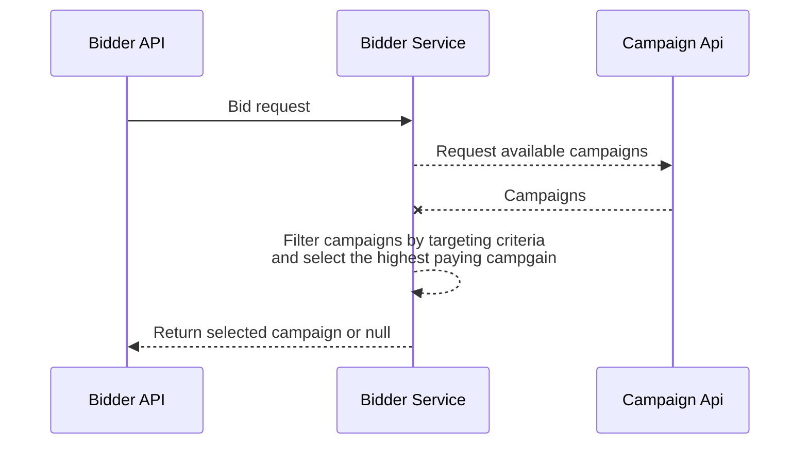

# Objective

You are a software engineer for an advertising technology company called Project Agora. The
company wants to enter the world of real-time bidding (RTB) and you are asked to implement a
real-time bidder for mobile advertising campaigns.

### Real-Time Bidder (RTB)

A bidder is simply a platform which allows advertisers to submit bids to buy mobile ad space in
real-time. A bidder receives bid requests from 3rd-party ad exchanges and responds back with a
bid response. This bid then competes with bids from other bidders in a real-time auction at the
exchange. The highest bid (in terms of bid price) wins and gets to show its ad.

# Approach

## Architecture of the system

The flowchart below demonstrates the main components of this solution as well as the flow of data.



## Designing the Bidder API

The Bidder receives bid requests from an ad exchange and it responds back either with a bid or
an empty response. The bid request from the ad exchange contains info that is needed by the bidder to perform its operation.

The Bidder API is available without authentication and exposes a single endpoint.

> **_POST:_** /api/bids

### Request Headers

The Content-Type header is set to ``application/octet-stream`` by the RTB protocol.

| Header         | Value                      |
|:---------------|:---------------------------|
| `Content-Type` | `application/octet-stream` |

### Request Body

The bid request contains the bid id, information concerning the mobile app asking for an ad and mobile device information such as OS, geo location and device id.

```javascript
{
  "id"     : string,
  "app"    : {
      "id" : string,
      "name" :string      
    }
  "device" : {
      "dpidsha1" : string,
      "os" : string,
      "geo": {
            "country": string,
            "lat": number,
            "lon": number 
        }
    }
}
```

### Responses

The Bidder can either respond with the winning campaign's bid or with an empty response.

Bid response:
- ``id`` the unique id of the bid
- ``campaign_id`` the id of the winning campaign
- ``price`` the price of the winning campaign
- ``ad_creative`` contains the Js code that is going to be rendered

```javascript
{
  "id"          : string,
  "campaign_id" : string,
  "price"       : number,
  "ad_creative" : string
}
```
The Bidder API returns the following status codes in its API:

| Status Code | Result        | Description                  |
|:------------|:--------------|:-----------------------------|
| 200         | `OK`          | `Submit matching Bid`        |
| 204         | `NO CONTENT`  | `No matching Bids` |
| 400         | `BAD REQUEST` | `Invalid request`            |

## Designing the Campaign API

The Campaign API is an external service that provides all the available campaigns to the Bidder.

It is available without authentication and exposes a single endpoint.

> **_GET:_** /api/campaigns

### Request Headers

| Header         | Value              |
|:---------------|:-------------------|
| `Content-Type` | `application/json` |

### Request Body

The Campaign API receives no input.

### Response

The Campaign API responds with an array containing all the available campaigns.

Campaign Model:
- ``id`` the unique id of the campaign
- ``name`` the name of the campaign
- ``price`` the price of the campaign
- ``ad_creative`` contains the Js code that is going to be rendered
- ``targetedCountries`` contains country names or the string ``"ALL COUNTRIES"``
- ``targetedLocations`` can either contain lat-lon ranges in the form of sorted tuples or the string ``"ALL LOCATIONS"`` 

```javascript
[
    {
        "id"          : string,
        "name"        : string,
        "price"       : number,
        "ad_creative" : string,
        "targetedCountries" : string [],
        "targetedLocations" : [
            "ALL LOCATIONS",
            {
                "lat": [number, number],
                "lon": [number, number]
            },
        ],
    }
]
```
The Campaign API returns the following status codes in its API:

| Status Code | Result        | 
|:------------|:--------------|
| 200         | `OK`          |

## Designing the Bidder Service

The Bidder service is responsible for processing the Bid request and generating a valid Bid response.

The core functionalities of this service is to:
- Retrieve all the available campaigns from the campaigns pool.
- Filter out campaigns that do not match the targeting criteria
- Find the highest paying campaign and generate a valid Bid response
- If there were no matching campaigns, it returns null.



## Designing the End to End Test Cases for the Bidder

Because the Bidder depends on the Campaign API, it will be mocked in order to simulate the real production functionality.

### Test Scenario 1: The Bidder accepts only valid requests

Respond with 404 Bad Request:

- When not providing body
- Given correct body but wrong content type header
- When body is missing the bid id
- When body is missing the app info
- When body is missing the device info

### Test Scenario 2: The Bidder responds correctly on valid requests
- Test with bidGreece example
  - It is returning the correct status code
  - It is returning the correct Bid response

<ins>BidGreece Example</ins>
```json
{
  "id": "0123456789ABCDEF0123456789ABCDEF",
  "app": {
    "id": "agltb3B1Yi1pbmNyDAsSA0FwcBiJkfIUDA",
    "name": "Yahoo Weather"
  },
  "device": {
    "dpidsha1": "AA000DFE74168477C70D291f574D344790E0BB11",
    "os": "iOS",
    "geo": {
      "country": "GREECE",
      "lat": 23.725016,
      "lon": 37.970801
    }
  }
}
```

- Test with bidUsa example
  - It is returning the correct status code
  - It is returning the correct Bid response

<ins>BidUsa Example</ins>
```json
{
  "id": "7979d0c78074638bbdf739ffdf285c7e1c74a691",
  "app": {
    "id": "20625",
    "name": "com.cheezburger.icanhas"
  },
  "device": {
    "dpidsha1": "F099E6D1C485756C45D1EEACB33C73B55C4BC499",
    "os": "Android",
    "geo": {
      "country": "USA",
      "lat": 35.012345,
      "lon": -115.12345
    }
  }
}
```
## Mocking the Campaign API

The Campaign API has been mocked in two ways:
- Using ``nock`` npm package on the End to End tests to intercept the external http request.
- Using ``express-mock-api-middleware`` npm package to create a fully operational mocked Campaign API.

## Running the tests

The tests are being run on every push to ``master`` branch by the pipeline created using Github Actions.

For the manual execution of the tests move to ``/bidder`` folder and run:
- ``npm install``
- ``npm run test``

<ins>You will need to have ``node`` installed on your local machine.</ins>

## Deployment

For the build and deployment, a Dockerfile has been created for each service and and docker-compose has been used as an orchestration tool.

<ins>You will need to have ``docker`` and ``docker-compose`` installed on your local machine.</ins>

While being on the root of the repository type on the terminal to start the containers:

```dockerfile
docker-compose up --build
```

The Bidder API and the Campaign API will be exposed to ports **3000** and **3001** respectively.

